-   [Supuestos de RLM](#supuestos-de-rlm)
-   [Análisis Discriminante](#analisis-discriminante)
-   [Análisis de correlación canónica
    (CCA)](#analisis-de-correlacion-canonica-cca)
-   [Referencias](#referencias)

------------------------------------------------------------------------

<!--
La revisión metodológica aquí vertida se basa en [@Wang_2012].
-->
Los contenidos de este material se basa principalemente en Schumacker
(2015). Las referencias o extensiones necesarias se citarán conforme se
desarrolla el material.

Supuestos de RLM
----------------

#### Librerías usadas en esta sección

    library(AER)
    library(sandwich)
    library(lmtest)
    library(lmSupport)

### Multicolinealidad

#### El problema:

*β̂* = (*X*′*X*) − 1*X*′*Y*
 - Se tiene un problema en cuanto a la transpuesta de la matriz
(*X*′*X*)

-   Perfecta: Si se tiene este tipo, el modelo simplemente no toma en
    cuenta esta variable
-   Imperfecta: El cáclulo de la inversa es computacionalmente exigente

#### Posibles causas

-   El método de recolección de información
-   Restricciones en el modelo o en la población objeto de muestreo
-   Especificación del modelo
-   Un modelo sobredetermindado
-   Series de tiempo

#### ¿Cuál es la naturaleza de la multicolinealidad?

**Causas** - ¿Cuáles son sus consecuencias prácticas?

**Incidencia en los errores estándar y sensibilidad**

-   ¿Cómo se detecta?

**Pruebas**

#### ¿Qué medidas pueden tomarse para aliviar el problema de multicolinealidad?

-   No hacer nada
-   Eliminar variables
-   Transformación de variables
-   Añadir datos a la muestra
-   Componentes principales, factores, entre otros

#### ¿Cómo se detecta?

-   Un *R*2 elevado pero con pocas razones *t* significativas
-   Regresiones auxiliares (Pruebas de Klein)
-   Factor de inflación de la varianza
    $$
    VIF = \\frac{1}{(1-R^2)}
    $$

#### Ejemplo 1

-   Haremos uso del paquete AER
-   Abrir la tabla 10.8
-   Ajusta el modelo

donde

-   *X*1 índice implícito de deflación de precios para el
    PIB,
-   *X*2 es el PIB (en millones de dólares),
-   *X*3 número de desempleados (en miles),
-   *X*4 número de personas enlistadas en las fuerzas
    armadas,
-   *X*5 población no institucionalizada mayor de 14 años de
    edad
-   *X*6 año (igual a 1 para 1947, 2 para 1948 y 16 para
    1962).

*Y**i* = *β*0 + *β*1*X*1 + *β*2*X*2 + *β*3*X*3 + *β*4*X*4 + *β*5*X*5 + *u**i*

-   Analice los resultados

<!-- -->

    uu <- "https://raw.githubusercontent.com/vmoprojs/DataLectures/master/tabla10_8.csv"
    datos<- read.csv(url(uu),sep=";",header=TRUE)

Agreguemos el tiempo: - Las correlaciones muy altas también suelen ser
síntoma de multicolinealidad

    ajuste.2 <- lm(Y~X1+X2+X3+X4+X5+TIME,data = datos)
    summary(ajuste.2)

    ## 
    ## Call:
    ## lm(formula = Y ~ X1 + X2 + X3 + X4 + X5 + TIME, data = datos)
    ## 
    ## Residuals:
    ##    Min     1Q Median     3Q    Max 
    ## -381.7 -167.6   13.7  105.5  488.9 
    ## 
    ## Coefficients:
    ##               Estimate Std. Error t value Pr(>|t|)   
    ## (Intercept)  6.727e+04  2.324e+04   2.895  0.02005 * 
    ## X1          -2.051e+00  8.710e+00  -0.235  0.81974   
    ## X2          -2.733e-02  3.317e-02  -0.824  0.43385   
    ## X3          -1.952e+00  4.767e-01  -4.095  0.00346 **
    ## X4          -9.582e-01  2.162e-01  -4.432  0.00219 **
    ## X5           5.134e-02  2.340e-01   0.219  0.83181   
    ## TIME         1.585e+03  4.827e+02   3.284  0.01112 * 
    ## ---
    ## Signif. codes:  0 '***' 0.001 '**' 0.01 '*' 0.05 '.' 0.1 ' ' 1
    ## 
    ## Residual standard error: 295.6 on 8 degrees of freedom
    ## Multiple R-squared:  0.9955, Adjusted R-squared:  0.9921 
    ## F-statistic: 295.8 on 6 and 8 DF,  p-value: 6.041e-09

    with(datos,cor(cbind(X1,X2,X3,X4,X5,TIME)))

    ##             X1        X2         X3         X4        X5      TIME
    ## X1   1.0000000 0.9936689  0.5917342  0.4689737 0.9833160 0.9908435
    ## X2   0.9936689 1.0000000  0.5752804  0.4587780 0.9896976 0.9947890
    ## X3   0.5917342 0.5752804  1.0000000 -0.2032852 0.6747642 0.6465669
    ## X4   0.4689737 0.4587780 -0.2032852  1.0000000 0.3712428 0.4222098
    ## X5   0.9833160 0.9896976  0.6747642  0.3712428 1.0000000 0.9957420
    ## TIME 0.9908435 0.9947890  0.6465669  0.4222098 0.9957420 1.0000000

-   Prueba de Klein: Se basa en realizar regresiones auxiliares de
    *todas contra todas* las variables regresoras.
-   Si el *R*2 de la regresión aux es mayor que la global,
    esa variable regresora podría ser la que genera multicolinealidad
-   ¿Cuántas regresiones auxiliares se tiene en un modelo en general?

Regresemos una de las variables

    ajuste.3<- lm(X1~X2+X3+X4+X5+TIME,data = datos)
    summary(ajuste.3)

    ## 
    ## Call:
    ## lm(formula = X1 ~ X2 + X3 + X4 + X5 + TIME, data = datos)
    ## 
    ## Residuals:
    ##      Min       1Q   Median       3Q      Max 
    ## -18.8602  -4.3277  -0.3175   4.3726  14.8438 
    ## 
    ## Coefficients:
    ##               Estimate Std. Error t value Pr(>|t|)  
    ## (Intercept)  1.529e+03  7.288e+02   2.098   0.0653 .
    ## X2           2.543e-03  9.453e-04   2.690   0.0248 *
    ## X3           3.056e-02  1.514e-02   2.019   0.0742 .
    ## X4           1.011e-02  7.559e-03   1.337   0.2140  
    ## X5          -1.263e-02  7.903e-03  -1.598   0.1445  
    ## TIME        -1.621e+01  1.766e+01  -0.918   0.3826  
    ## ---
    ## Signif. codes:  0 '***' 0.001 '**' 0.01 '*' 0.05 '.' 0.1 ' ' 1
    ## 
    ## Residual standard error: 11.31 on 9 degrees of freedom
    ## Multiple R-squared:  0.9923, Adjusted R-squared:  0.9881 
    ## F-statistic: 232.5 on 5 and 9 DF,  p-value: 3.127e-09

    tolerancia<-1-0.9923

**Factor de inflación de la varianza**

Si este valor es mucho mayor que 10 y se podría concluir que si hay
multicolinealidad

    vif <- 1/tolerancia
    vif

    ## [1] 129.8701

Ahora vamos a usar el paquete `AER`:

    library(AER)

    vif1 <- vif(ajuste.2)
    Raux <- (vif1-1)/vif1
    Rglobal <- 0.9955

    Rglobal-Raux

    ##           X1           X2           X3           X4           X5 
    ##  0.003181137 -0.003829181  0.026533869  0.254649059 -0.001623122 
    ##         TIME 
    ## -0.003160352

Se podría no hacer nada ante este problema. O se puede tratar con
transformaciones. Deflactamos el PIB: `PIB_REAL <- X2/X1`

    # La variable X5 (población) 
    # esta correlacionada con el tiempo
    PIB_REAL <- datos$X2/datos$X1
    ajuste.4<-lm(Y~PIB_REAL+X3+X4, data = datos)
    summary(ajuste.4)

    ## 
    ## Call:
    ## lm(formula = Y ~ PIB_REAL + X3 + X4, data = datos)
    ## 
    ## Residuals:
    ##     Min      1Q  Median      3Q     Max 
    ## -760.29 -197.71  -53.69  234.77  603.15 
    ## 
    ## Coefficients:
    ##               Estimate Std. Error t value Pr(>|t|)    
    ## (Intercept) 42716.5646   710.1206  60.154 3.31e-15 ***
    ## PIB_REAL       72.0074     3.3286  21.633 2.30e-10 ***
    ## X3             -0.6810     0.1693  -4.023  0.00201 ** 
    ## X4             -0.8392     0.2206  -3.805  0.00292 ** 
    ## ---
    ## Signif. codes:  0 '***' 0.001 '**' 0.01 '*' 0.05 '.' 0.1 ' ' 1
    ## 
    ## Residual standard error: 389 on 11 degrees of freedom
    ## Multiple R-squared:  0.9893, Adjusted R-squared:  0.9864 
    ## F-statistic: 339.5 on 3 and 11 DF,  p-value: 4.045e-11

    vif(ajuste.4)

    ## PIB_REAL       X3       X4 
    ## 3.054580 2.346489 2.318500

    ajuste.5<-lm(Y~PIB_REAL+X3+X4,data = datos)
    summary(ajuste.5)

    ## 
    ## Call:
    ## lm(formula = Y ~ PIB_REAL + X3 + X4, data = datos)
    ## 
    ## Residuals:
    ##     Min      1Q  Median      3Q     Max 
    ## -760.29 -197.71  -53.69  234.77  603.15 
    ## 
    ## Coefficients:
    ##               Estimate Std. Error t value Pr(>|t|)    
    ## (Intercept) 42716.5646   710.1206  60.154 3.31e-15 ***
    ## PIB_REAL       72.0074     3.3286  21.633 2.30e-10 ***
    ## X3             -0.6810     0.1693  -4.023  0.00201 ** 
    ## X4             -0.8392     0.2206  -3.805  0.00292 ** 
    ## ---
    ## Signif. codes:  0 '***' 0.001 '**' 0.01 '*' 0.05 '.' 0.1 ' ' 1
    ## 
    ## Residual standard error: 389 on 11 degrees of freedom
    ## Multiple R-squared:  0.9893, Adjusted R-squared:  0.9864 
    ## F-statistic: 339.5 on 3 and 11 DF,  p-value: 4.045e-11

    vif(ajuste.5)

    ## PIB_REAL       X3       X4 
    ## 3.054580 2.346489 2.318500

### Heterocedasticidad

Ocurre cuando la varianza no es constante.

¿Cuál es la naturaleza de la heterocedasticidad?

-   Modelos de aprendizaje de los errores: con el paso del tiempo, las
    personas cometen menos errores de comportamiento. Es decir que la
    varianza disminuye.
-   Ingreso direccional: Es probable que la varianza aumente con el
    ingreso dado que el aumento del ingreso se tiene más opciones del
    cómo disponer de él.

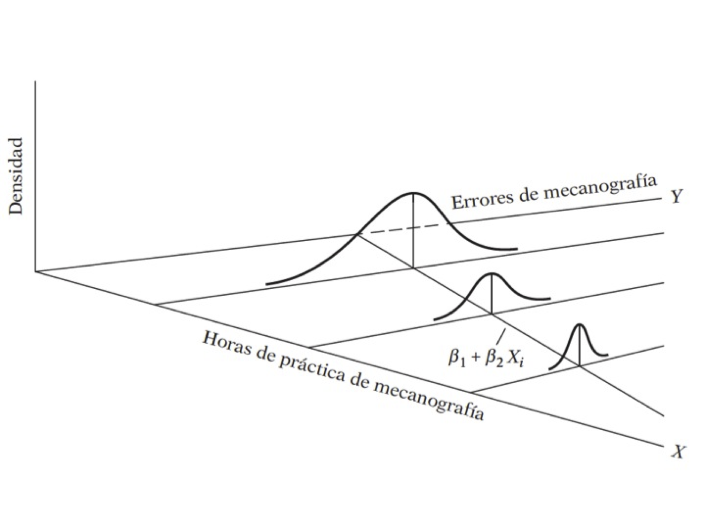

-   Técnicas de recolección de datos: si la técnica mejora, es probable
    que la varianza se reduzca.
-   Datos atípicos o aberrantes: Sensibilidad en las estimaciones
-   Especificaciones del modelo: Omisión de variables importantes en el
    modelo.
-   Asimentría: Surge a partir de la distribución de una o más
    regresoras en el modelo. Ejemplo: Distribución del ingreso
    *generalmente inequitativo*

#### ¿Cómo detectarla?

Método gráfico

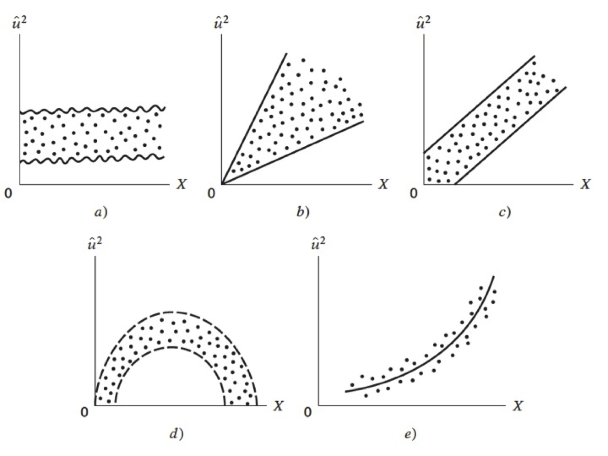

Veamos las pruebas de detección en un ejemplo

-   Abrir la base de datos *wage1* de Wooldrigde

<!-- -->

    uu <- "https://raw.githubusercontent.com/vmoprojs/DataLectures/master/wage1.csv"
    datos <- read.csv(url(uu),header=FALSE)
    names(datos) <- c("wage",  "educ",  "exper",  "tenure",    
                   "nonwhite",  "female",   "married",  
                   "numdep",    "smsa", "northcen", "south",
                   "west",  "construc", "ndurman",  "trcommpu",
                   "trade", "services", "profserv", "profocc",
                   "clerocc",   "servocc",  "lwage",    "expersq",
                   "tenursq")

    casados <- (1-datos$female)*datos$married  # female 1=mujer  married=1 casado
    casadas <- (datos$female)*datos$married
    solteras <- (datos$female)*(1-datos$married)
    solteros <- (1-datos$female)*(1-datos$married)

-   Correr el modelo
    *l**w**a**g**e* = *β*0 + *β*1*c**a**s**a**d**o**s* + *β*2*c**a**s**a**d**a**s* + *β*3*s**o**l**t**e**r**a**s* + *β*4*e**d**u**c* + *β*5*e**x**p**e**r* + *β*6*e**x**p**e**r**s**q* + *β*7*t**e**n**u**r**e* + *β*8*t**e**n**u**r**e**s**q* + *u**i*
-   Hacer un gráfico de los valores estimados y los residuos al cuadrado

### Prueba de Breusch Pagan

-   Correr un modelo de los residuos al cuadrado regresado en las
    variables explicativas del modelo global.
    *s**q**r**e**s**i**d* = *β*0 + *β*1*c**a**s**a**d**o**s* + *β*2*c**a**s**a**d**a**s* + *β*3*s**o**l**t**e**r**a**s* + *β*4*e**d**u**c* + *β*5*e**x**p**e**r* + *β*6*e**x**p**e**r**s**q* + *β*7*t**e**n**u**r**e* + *β*8*t**e**n**u**r**e**s**q* + *u**i*
-   `bptest(objeto)`: si el pvalor es inferior a 0.05,
    `Ho: Homocedasticidad`

El códgio en `R` es:

    ajuste1 <- lm(lwage~casados+casadas+solteras+educ+exper+
                      expersq+tenure+tenursq,data = datos)

    summary(ajuste1)

    ## 
    ## Call:
    ## lm(formula = lwage ~ casados + casadas + solteras + educ + exper + 
    ##     expersq + tenure + tenursq, data = datos)
    ## 
    ## Residuals:
    ##      Min       1Q   Median       3Q      Max 
    ## -1.89697 -0.24060 -0.02689  0.23144  1.09197 
    ## 
    ## Coefficients:
    ##               Estimate Std. Error t value Pr(>|t|)    
    ## (Intercept)  0.3213780  0.1000090   3.213 0.001393 ** 
    ## casados      0.2126756  0.0553572   3.842 0.000137 ***
    ## casadas     -0.1982677  0.0578355  -3.428 0.000656 ***
    ## solteras    -0.1103502  0.0557421  -1.980 0.048272 *  
    ## educ         0.0789103  0.0066945  11.787  < 2e-16 ***
    ## exper        0.0268006  0.0052428   5.112 4.50e-07 ***
    ## expersq     -0.0005352  0.0001104  -4.847 1.66e-06 ***
    ## tenure       0.0290875  0.0067620   4.302 2.03e-05 ***
    ## tenursq     -0.0005331  0.0002312  -2.306 0.021531 *  
    ## ---
    ## Signif. codes:  0 '***' 0.001 '**' 0.01 '*' 0.05 '.' 0.1 ' ' 1
    ## 
    ## Residual standard error: 0.3933 on 517 degrees of freedom
    ## Multiple R-squared:  0.4609, Adjusted R-squared:  0.4525 
    ## F-statistic: 55.25 on 8 and 517 DF,  p-value: < 2.2e-16

    residuos <- resid(ajuste1)
    sqresid <- residuos^2
    y_techo <- fitted(ajuste1)
    plot(y_techo,sqresid) 

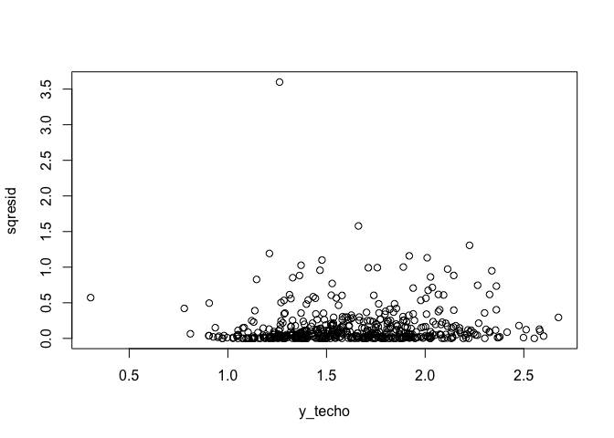

    plot(fitted(ajuste1),resid(ajuste1))

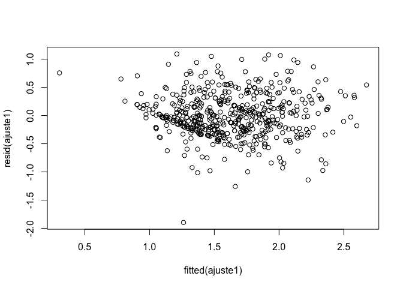

    # Usando el "default" de R:
    par(mfrow=c(2,2))
    plot(ajuste1)

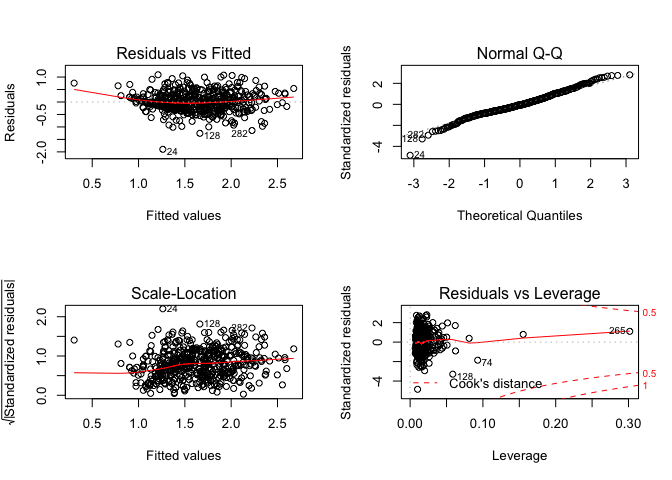

    par(mfrow=c(1,1))

    library(sandwich)
    library(lmtest)
    #install.packages("lmSupport")
    library(lmSupport)

    # Test para ver si hay heterocedasticidad
    residuos <- resid(ajuste1)
    sqresid <- (residuos)^2
    ajuste2 <- lm(sqresid~casados+casadas+solteras+educ+exper+expersq+tenure+tenursq,data = datos)
    summary(ajuste2)

    ## 
    ## Call:
    ## lm(formula = sqresid ~ casados + casadas + solteras + educ + 
    ##     exper + expersq + tenure + tenursq, data = datos)
    ## 
    ## Residuals:
    ##     Min      1Q  Median      3Q     Max 
    ## -0.2346 -0.1237 -0.0887  0.0202  3.4689 
    ## 
    ## Coefficients:
    ##               Estimate Std. Error t value Pr(>|t|)   
    ## (Intercept)  5.029e-02  6.893e-02   0.729  0.46603   
    ## casados     -4.870e-02  3.816e-02  -1.276  0.20241   
    ## casadas     -5.147e-02  3.986e-02  -1.291  0.19727   
    ## solteras     4.162e-03  3.842e-02   0.108  0.91379   
    ## educ         3.849e-03  4.614e-03   0.834  0.40462   
    ## exper        1.008e-02  3.614e-03   2.790  0.00546 **
    ## expersq     -2.071e-04  7.611e-05  -2.720  0.00674 **
    ## tenure       4.763e-04  4.661e-03   0.102  0.91864   
    ## tenursq      8.670e-05  1.594e-04   0.544  0.58672   
    ## ---
    ## Signif. codes:  0 '***' 0.001 '**' 0.01 '*' 0.05 '.' 0.1 ' ' 1
    ## 
    ## Residual standard error: 0.2711 on 517 degrees of freedom
    ## Multiple R-squared:  0.02507,    Adjusted R-squared:  0.009989 
    ## F-statistic: 1.662 on 8 and 517 DF,  p-value: 0.105

    # F =1.662 y pvalue=0.105 NO EXISTE HETEROCEDASTICIDAD
    #Breusch-Pagan test

    'bptest es igual a hettest en STATA'

    ## [1] "bptest es igual a hettest en STATA"

    bptest(ajuste1)

    ## 
    ##  studentized Breusch-Pagan test
    ## 
    ## data:  ajuste1
    ## BP = 13.189, df = 8, p-value = 0.1055

Para estimar errores robustos (como `robust` en stata):

    coeftest(ajuste1, vcovHC(ajuste1,"HC0"))

    ## 
    ## t test of coefficients:
    ## 
    ##                Estimate  Std. Error t value  Pr(>|t|)    
    ## (Intercept)  0.32137805  0.10852844  2.9612 0.0032049 ** 
    ## casados      0.21267564  0.05665095  3.7541 0.0001937 ***
    ## casadas     -0.19826765  0.05826506 -3.4029 0.0007186 ***
    ## solteras    -0.11035021  0.05662552 -1.9488 0.0518632 .  
    ## educ         0.07891029  0.00735096 10.7347 < 2.2e-16 ***
    ## exper        0.02680057  0.00509497  5.2602 2.111e-07 ***
    ## expersq     -0.00053525  0.00010543 -5.0770 5.360e-07 ***
    ## tenure       0.02908752  0.00688128  4.2270 2.800e-05 ***
    ## tenursq     -0.00053314  0.00024159 -2.2068 0.0277671 *  
    ## ---
    ## Signif. codes:  0 '***' 0.001 '**' 0.01 '*' 0.05 '.' 0.1 ' ' 1

### Autocorrelación

-   ¿Cuál es la naturaleza de la autocorrelación?
-   ¿Cuáles son las consecuencias teóricas y prácticas de la
    autocorrelación?
-   ¿Cómo remediar el problema de la autocorrelación?

> *Autocorrelación:* correlación entre miembros de series de
> observaciones ordenadas en el tiempo \[como en datos de series de
> tiempo\] o en el espacio \[como en datos de corte transversal\]:

$$
E(u\_i,u\_j) \\neq 0 \\\\
i \\neq j
$$
 El supuesto es:
$$
cov(u\_i,u\_j|x\_i,x\_j)  = E(u\_i,u\_j) = 0 \\\\
i \\neq j
$$

-   Datos atípicos o aberrantes: Sensibilidad en las estimaciones
-   Especificaciones del modelo: Omisión de variables importantes en el
    modelo.
-   Asimentría: Surge a partir de la distribución de una o más
    regresoras en el modelo. Ejemplo: Distribución del ingreso
    *generalmente inequitativo*

#### Cómo detectarla sesgos de especificación

Método gráfico

 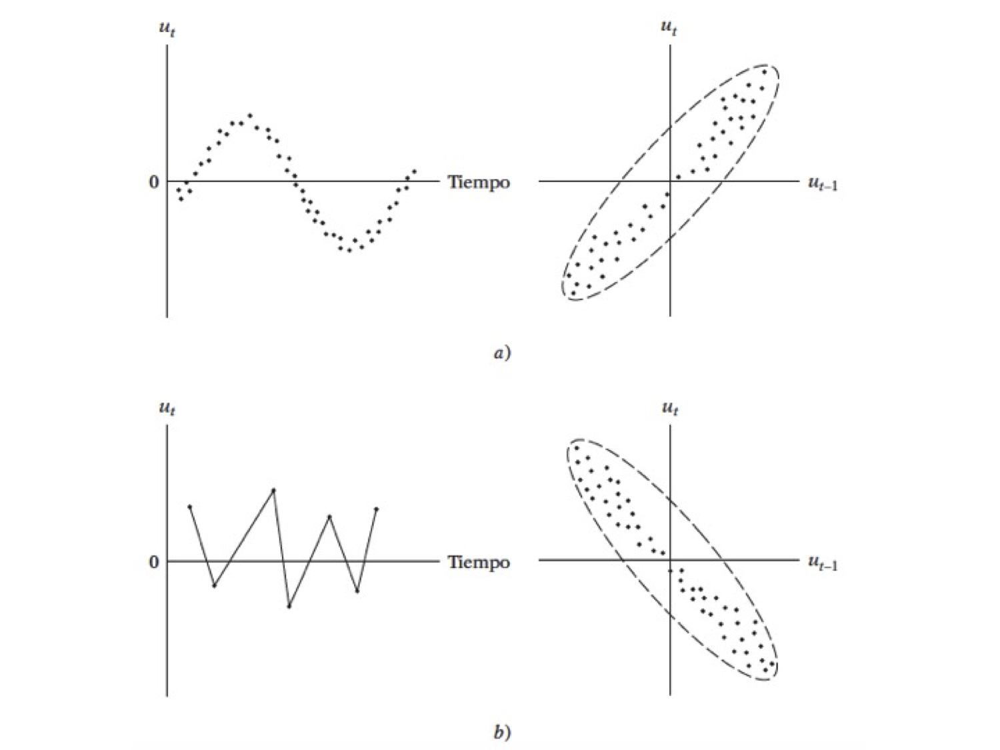

Veamos las pruebas de detección en un ejemplo

#### Ejemplo

Abrir la `tabla 12.4`. Veamos los datos en forma gráfica, y corramos el
modelo:

-   Y, índices de remuneración real por hora
-   X, producción por hora X

<!-- -->

    uu <- "https://raw.githubusercontent.com/vmoprojs/DataLectures/master/tabla12_4.csv"
    datos1<- read.csv(url(uu), sep=";",dec=".", header=T)

    #Indice de compensacion real (salario real)
    plot(datos1$X,datos1$Y)

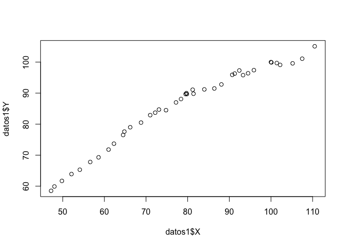

    ajuste.indice<-lm(Y~X,data = datos1)
    summary(ajuste.indice)

    ## 
    ## Call:
    ## lm(formula = Y ~ X, data = datos1)
    ## 
    ## Residuals:
    ##    Min     1Q Median     3Q    Max 
    ## -5.138 -2.130  0.364  2.201  3.632 
    ## 
    ## Coefficients:
    ##             Estimate Std. Error t value Pr(>|t|)    
    ## (Intercept)  29.5192     1.9424   15.20   <2e-16 ***
    ## X             0.7137     0.0241   29.61   <2e-16 ***
    ## ---
    ## Signif. codes:  0 '***' 0.001 '**' 0.01 '*' 0.05 '.' 0.1 ' ' 1
    ## 
    ## Residual standard error: 2.676 on 38 degrees of freedom
    ## Multiple R-squared:  0.9584, Adjusted R-squared:  0.9574 
    ## F-statistic: 876.5 on 1 and 38 DF,  p-value: < 2.2e-16

Revisemos si hay autocorelación:

    residuos<- resid(ajuste.indice)
    plot(residuos,t="l",xlab="Tiempo")

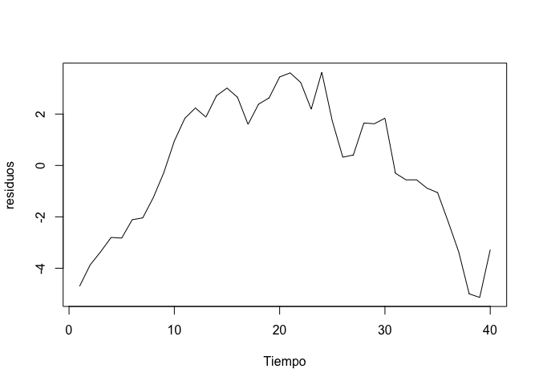

    par(mfrow = c(2,2))
    plot(ajuste.indice)

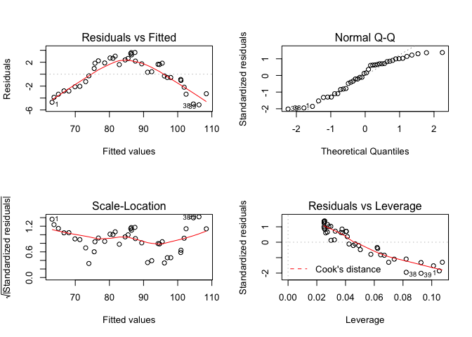

    par(mfrow = c(1,1))

-   Los datos NO DEBEN TENER UN PATRON (si tienen patron, algo anda mal)
-   En este caso se tiene un curva cuadrática, el modelo podría estar
    mal especificado.
-   Podría ser que el modelo no se lineal o estar correlacionado

Veamos si se trata de una función cuadrática y cúbica

    ajuste2 <- lm(Y~X+I(X^2),data = datos1)
    summary(ajuste2)

    ## 
    ## Call:
    ## lm(formula = Y ~ X + I(X^2), data = datos1)
    ## 
    ## Residuals:
    ##      Min       1Q   Median       3Q      Max 
    ## -1.58580 -0.76248  0.09209  0.68442  2.63570 
    ## 
    ## Coefficients:
    ##               Estimate Std. Error t value Pr(>|t|)    
    ## (Intercept) -1.622e+01  2.955e+00  -5.489 3.09e-06 ***
    ## X            1.949e+00  7.799e-02  24.987  < 2e-16 ***
    ## I(X^2)      -7.917e-03  4.968e-04 -15.936  < 2e-16 ***
    ## ---
    ## Signif. codes:  0 '***' 0.001 '**' 0.01 '*' 0.05 '.' 0.1 ' ' 1
    ## 
    ## Residual standard error: 0.9669 on 37 degrees of freedom
    ## Multiple R-squared:  0.9947, Adjusted R-squared:  0.9944 
    ## F-statistic:  3483 on 2 and 37 DF,  p-value: < 2.2e-16

    ajuste3 <- lm(Y~X+I(X^2)+I(X^3),data = datos1)
    summary(ajuste3)

    ## 
    ## Call:
    ## lm(formula = Y ~ X + I(X^2) + I(X^3), data = datos1)
    ## 
    ## Residuals:
    ##      Min       1Q   Median       3Q      Max 
    ## -1.63265 -0.79419  0.06568  0.66627  2.43810 
    ## 
    ## Coefficients:
    ##               Estimate Std. Error t value Pr(>|t|)    
    ## (Intercept) -2.222e+01  1.344e+01  -1.653 0.107060    
    ## X            2.196e+00  5.466e-01   4.018 0.000286 ***
    ## I(X^2)      -1.119e-02  7.178e-03  -1.559 0.127658    
    ## I(X^3)       1.398e-05  3.054e-05   0.458 0.649958    
    ## ---
    ## Signif. codes:  0 '***' 0.001 '**' 0.01 '*' 0.05 '.' 0.1 ' ' 1
    ## 
    ## Residual standard error: 0.9774 on 36 degrees of freedom
    ## Multiple R-squared:  0.9947, Adjusted R-squared:  0.9943 
    ## F-statistic:  2272 on 3 and 36 DF,  p-value: < 2.2e-16

Nos quedamos con el `ajuste2`.

El gráfico de los valores ajustados, muestra que se ha eliminado el
patron inicial

    par(mfrow = c(2,2))
    plot(ajuste2)  

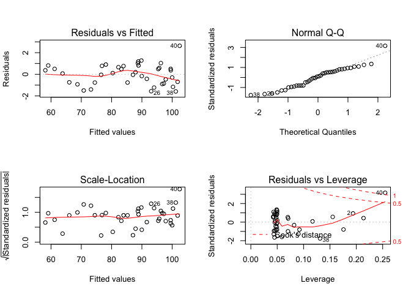

    par(mfrow = c(1,1))

    residuos2 <- resid(ajuste2)
    plot(residuos2,t="l",xlab="Tiempo")
    points(residuos2)
    abline(h=0,col="blue")

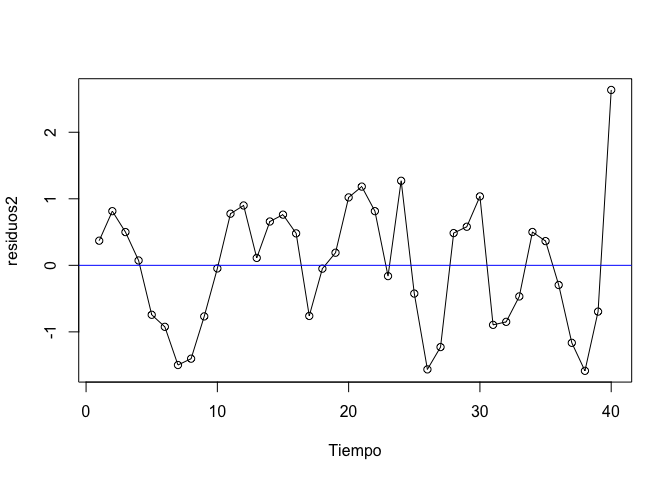

¿Cómo debe ser el gráfico?

    aleatorios=rnorm(40,0,1)
    plot(aleatorios,t="l",xlab="Tiempo")
    points(aleatorios)
    abline(h=0,col="blue")

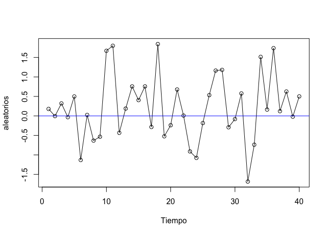

¿Se parece?

Ejemplo: Pruebas

> *H**o*: No hay autocorrelación

    dwtest(ajuste2)

    ## 
    ##  Durbin-Watson test
    ## 
    ## data:  ajuste2
    ## DW = 1.03, p-value = 0.0001178
    ## alternative hypothesis: true autocorrelation is greater than 0

¿Cuál es la conclusión?

Otra prueba:

    # Ajuste Breuch Godfrey (Ho: No hay autocorrelación)
    bgtest(ajuste2,order=4)

    ## 
    ##  Breusch-Godfrey test for serial correlation of order up to 4
    ## 
    ## data:  ajuste2
    ## LM test = 14.945, df = 4, p-value = 0.004817

Análisis Discriminante
----------------------

#### Librerías usadas en esta técnica

    library(car)
    library(vegan)
    library(mvnormtest)
    library(MASS)
    library(klaR)

<!-- https://rpubs.com/gabrielmartos/discriminantR -->
El **análisis discriminante lineal (LDA)** y el discriminante lineal de
Fisher relacionado son métodos utilizados en estadística, reconocimiento
de patrones y aprendizaje automático para **encontrar una combinación
lineal de características** que separa **dos o más clases de objetos o
eventos**. La combinación resultante se puede usar como un clasificador
lineal o, más comúnmente, para la **reducción de dimensionalidad antes
de la clasificación posterior**.

Considere un conjunto de observaciones *x* (también llamadas
características, atributos, variables o medidas) para cada muestra de un
objeto o evento con una clase conocida *y* ∈ {0, 1}. Este conjunto de
muestras se llama **conjunto de entrenamiento**. El problema de
clasificación es **encontrar un buen predictor** para la clase *y* de
cualquier muestra de la misma distribución (no necesariamente del
conjunto de entrenamiento), dado solo una observación *x*.

### Objetivos

-   Determinar si existen diferencias significativas entre los perfiles
    de un conjunto de variables de dos o más grupos definidos a priori.

-   Determinar cuál de las variables independientes cuantifica mejor las
    diferencias entre un grupo u otro.

-   Establecer un procedimiento para clasificar a un individuo en base a
    los valores de un conjunto de variables independientes.

### Posibles aplicaciones

-   **Predicción de bancarrota**: en la predicción de bancarrota basada
    en razones contables y otras variables financieras, el análisis
    discriminante lineal fue el primer método estadístico aplicado para
    explicar sistemáticamente qué empresas entraron en bancarrota
    vs. sobrevivieron.

-   **Comercialización**: en marketing, el análisis discriminante solía
    utilizarse para determinar los factores que distinguen diferentes
    tipos de clientes y/o productos sobre la base de encuestas u otras
    formas de datos recopilados.

-   **Estudios biomédicos**: la principal aplicación del análisis
    discriminante en medicina es la evaluación del estado de gravedad de
    un paciente y el pronóstico del desenlace de la enfermedad. Por
    ejemplo, durante el análisis retrospectivo, los pacientes se dividen
    en grupos según la gravedad de la enfermedad, forma leve, moderada y
    grave. Luego, se estudian los resultados de los análisis clínicos y
    de laboratorio para revelar las variables que son estadísticamente
    diferentes en los grupos estudiados. Usando estas variables, se
    construyen funciones discriminantes que ayudan a clasificar
    objetivamente la enfermedad en un futuro paciente en una forma leve,
    moderada o severa.

### Comparación con otras técnicas

La técnica más común para establecer relaciones, predecir y explicar
variables son las técnicas de regresión. **El problema está cuando la
variable a explicar no es una variable medible (o métrica)**; en este
caso existen dos tipos de análisis con los que resolver el problema, el
análisis discriminante y la regresión logística. En ambos análisis
tendremos una variable dependiente categórica y varias variables
independientes numéricas.

En muchas ocasiones la variable categórica consta de dos grupos o
clasificaciones (por ejemplo, bancarrota-no bancarrota). En otras
situaciones la variable categórica tendrá tres o más subgrupos
(e.g. bajo, medio y alto nivel de cierta dosis). La regresión logística
o logito, en su forma básica está restringida a dos grupos frente al
análisis discriminante que vale para más de dos.

### Supuestos

-   La *variable dependiente* (grupos) debe ser categórica en la que el
    número de grupos puede ser de dos o más, pero han de ser
    **mutuamente excluyentes y exhaustivos**. Aunque la variable
    dependiente puede ser originariamente numérica y que el investigador
    la cuantifique en términos de categorías.

-   Las *variables independientes* numéricas se seleccionan
    identificando las variables en una investigación previa o mediante
    información a priori, de tal manera que se sepa que esas variables
    son importantes para predecir en qué grupo estará la variable
    dependiente. Se puede utilizar el análisis cluster para formar los
    grupos, pero se recomienda seguir los siguientes pasos: dividir los
    datos en 2 grupos, aplicar el análisis cluster en uno de ellos y
    utilizar los resultados en el DA para el segundo grupo de datos.

-   Con respecto al *tamaño de las muestras*, se suele recomendar que
    los tamaños de cada grupo no sean muy diferentes, ya que con esto la
    probabilidad de pertenecer a un grupo o a otro puede variar
    considerablemente. Se necesita que al menos tengamos 4 o 5 veces más
    observaciones por grupo que el número de variables que utilicemos.
    Además, el número de observaciones en el grupo más pequeño debe ser
    mayor que el número de variables.

-   También existen dos hipótesis previas que deben ser contrastadas,
    estas son: la **normalidad multivariante** y la de la **estructura
    de varianzas-covarianzas desconocidas pero iguales** (*homogeneidad
    de varianzas* entre grupos). Los datos que no cumplen el supuesto de
    normalidad pueden causar problemas en la estimación y en ese caso se
    sugiere utilizar la regresión logística. Si existen grandes
    desviaciones en las varianzas, se puede solucionar con la ampliación
    de la muestra o con técnicas de clasificación cuadráticas. **La
    homogeneidad de varianzas significa que la relación entre variables
    debe ser similar para los distintos grupos**. Por tanto, una
    variable no puede tener el mismo valor para todas las observaciones
    dentro de un grupo.

-   Los datos además no deben presentar *multicolinealidad*, es decir,
    que dos o más variables independientes estén muy relacionadas. Si
    las variables tienen un valor de correlación de 0.9 o mayor se debe
    eliminar una de ellas.

-   También se supone *linealidad* entre las variables ya que se utiliza
    la matriz de covarianza.

Si no se cumplen los supuestos de normalidad y homogeneidad, podemos
utilizar una transformación logarítmica o de la raíz cuadrada (entre
otras).

### El modelo

El análisis discriminante implica un valor teórico como combinación
lineal de dos o más variables independientes que discrimine entre los
grupos definidos a priori. La discriminación se lleva a cabo
estableciendo las ponderaciones del valor teórico de cada variable, de
tal forma que **maximicen la varianza entre-grupos frente a la
intra-grupos**. La combinación lineal o función discriminante, toma la
siguiente forma:

*D**i* = *a* + *W*1*X*1, *i* + *W*2*X*2, *i* + … + *W**n**X**n*, *i*

donde: *D**i* es la puntuación discriminante (grupo de
pertenencia) del individuo i-ésimo; a es una constante;
*W**j* es la ponderación de la variable j-ésima. El resultado
de esta función será para un conjunto de variables *X*1, …, *X**n* un
valor de *D* que discrimine al individuo en un grupo u otro. Destacamos
que el análisis discriminante **proporcionará una función discriminate
menos que los subgrupos que tengamos**, es decir, si la variable
categórica tiene dos subgrupos, obtendremos una función discriminante,
si tiene tres subgrupos obtendremos dos y así sucesivamente.

### Ejemplo 1: clasificación de vinos

En este primer caso de estudio, el conjunto de datos del vino, tenemos
13 concentraciones químicas que describen muestras de vino de tres
cultivos.

    library(car)
    # install.packages('rattle')
    uu <- "https://gist.githubusercontent.com/tijptjik/9408623/raw/b237fa5848349a14a14e5d4107dc7897c21951f5/wine.csv"
    wine <- read.csv(url(uu))
    head(wine)

    scatterplotMatrix(wine[2:6])

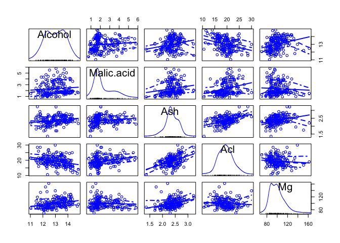

El propósito del análisis discriminante lineal (LDA) en este ejemplo es
encontrar las combinaciones lineales de las variables originales (las 13
concentraciones químicas aquí) que proporcionan la mejor separación
posible entre los grupos (variedades de vino aquí) en nuestro conjunto
de datos. El análisis discriminante lineal también se conoce como
**análisis discriminante canónico**, o simplemente **análisis
discriminante**.

### Supuestos:

**Homogeneidad de varianzas multivariante**

    library(vegan)
    # seleccionamos las variables ambientales a analizar 
    env.pars2 <- as.matrix(wine[, 2:14])
    # verificamos la homogeneidad multivariada de las matrices de covarianza intra-grupo
    env.pars2.d1 <- dist(env.pars2)
    env.MHV <- betadisper(env.pars2.d1, wine$Wine)
    anova(env.MHV)

    permutest(env.MHV)

    ## 
    ## Permutation test for homogeneity of multivariate dispersions
    ## Permutation: free
    ## Number of permutations: 999
    ## 
    ## Response: Distances
    ##            Df  Sum Sq Mean Sq      F N.Perm Pr(>F)    
    ## Groups      2  190082   95041 8.3286    999  0.001 ***
    ## Residuals 175 1997003   11411                         
    ## ---
    ## Signif. codes:  0 '***' 0.001 '**' 0.01 '*' 0.05 '.' 0.1 ' ' 1

*Conclusión*: rechazo la hipótesis nula de homogeneidad intra-grupo. Se
podría hacer transformaciones logarítmicas para enfrentar este asunto.

**Normalidad multivariante**

    library(mvnormtest)
    mshapiro.test(t(env.pars2))

    ## 
    ##  Shapiro-Wilk normality test
    ## 
    ## data:  Z
    ## W = 0.83696, p-value = 7.846e-13

Rechazamos la *H**o* de normalidad multivariante

**Multicolinealidad**

    as.dist(cor(env.pars2))

    ##                           Alcohol   Malic.acid          Ash          Acl
    ## Malic.acid            0.094396941                                       
    ## Ash                   0.211544596  0.164045470                          
    ## Acl                  -0.310235137  0.288500403  0.443367187             
    ## Mg                    0.270798226 -0.054575096  0.286586691 -0.083333089
    ## Phenols               0.289101123 -0.335166997  0.128979538 -0.321113317
    ## Flavanoids            0.236814928 -0.411006588  0.115077279 -0.351369860
    ## Nonflavanoid.phenols -0.155929467  0.292977133  0.186230446  0.361921719
    ## Proanth               0.136697912 -0.220746187  0.009651935 -0.197326836
    ## Color.int             0.546364195  0.248985344  0.258887259  0.018731981
    ## Hue                  -0.071747197 -0.561295689 -0.074666889 -0.273955223
    ## OD                    0.072343187 -0.368710428  0.003911231 -0.276768549
    ## Proline               0.643720037 -0.192010565  0.223626264 -0.440596931
    ##                                Mg      Phenols   Flavanoids
    ## Malic.acid                                                 
    ## Ash                                                        
    ## Acl                                                        
    ## Mg                                                         
    ## Phenols               0.214401235                          
    ## Flavanoids            0.195783770  0.864563500             
    ## Nonflavanoid.phenols -0.256294049 -0.449935301 -0.537899612
    ## Proanth               0.236440610  0.612413084  0.652691769
    ## Color.int             0.199950006 -0.055136418 -0.172379398
    ## Hue                   0.055398196  0.433681335  0.543478566
    ## OD                    0.066003936  0.699949365  0.787193902
    ## Proline               0.393350849  0.498114880  0.494193127
    ##                      Nonflavanoid.phenols      Proanth    Color.int
    ## Malic.acid                                                         
    ## Ash                                                                
    ## Acl                                                                
    ## Mg                                                                 
    ## Phenols                                                            
    ## Flavanoids                                                         
    ## Nonflavanoid.phenols                                               
    ## Proanth                      -0.365845099                          
    ## Color.int                     0.139057013 -0.025249931             
    ## Hue                          -0.262639631  0.295544253 -0.521813193
    ## OD                           -0.503269596  0.519067096 -0.428814942
    ## Proline                      -0.311385188  0.330416700  0.316100113
    ##                               Hue           OD
    ## Malic.acid                                    
    ## Ash                                           
    ## Acl                                           
    ## Mg                                            
    ## Phenols                                       
    ## Flavanoids                                    
    ## Nonflavanoid.phenols                          
    ## Proanth                                       
    ## Color.int                                     
    ## Hue                                           
    ## OD                    0.565468293             
    ## Proline               0.236183447  0.312761075

    library(MASS)
    wine.lda <- lda(Wine ~ ., data=wine)
    wine.lda

    ## Call:
    ## lda(Wine ~ ., data = wine)
    ## 
    ## Prior probabilities of groups:
    ##         1         2         3 
    ## 0.3314607 0.3988764 0.2696629 
    ## 
    ## Group means:
    ##    Alcohol Malic.acid      Ash      Acl       Mg  Phenols Flavanoids
    ## 1 13.74475   2.010678 2.455593 17.03729 106.3390 2.840169  2.9823729
    ## 2 12.27873   1.932676 2.244789 20.23803  94.5493 2.258873  2.0808451
    ## 3 13.15375   3.333750 2.437083 21.41667  99.3125 1.678750  0.7814583
    ##   Nonflavanoid.phenols  Proanth Color.int       Hue       OD   Proline
    ## 1             0.290000 1.899322  5.528305 1.0620339 3.157797 1115.7119
    ## 2             0.363662 1.630282  3.086620 1.0562817 2.785352  519.5070
    ## 3             0.447500 1.153542  7.396250 0.6827083 1.683542  629.8958
    ## 
    ## Coefficients of linear discriminants:
    ##                               LD1           LD2
    ## Alcohol              -0.403399781  0.8717930699
    ## Malic.acid            0.165254596  0.3053797325
    ## Ash                  -0.369075256  2.3458497486
    ## Acl                   0.154797889 -0.1463807654
    ## Mg                   -0.002163496 -0.0004627565
    ## Phenols               0.618052068 -0.0322128171
    ## Flavanoids           -1.661191235 -0.4919980543
    ## Nonflavanoid.phenols -1.495818440 -1.6309537953
    ## Proanth               0.134092628 -0.3070875776
    ## Color.int             0.355055710  0.2532306865
    ## Hue                  -0.818036073 -1.5156344987
    ## OD                   -1.157559376  0.0511839665
    ## Proline              -0.002691206  0.0028529846
    ## 
    ## Proportion of trace:
    ##    LD1    LD2 
    ## 0.6875 0.3125

Esto significa que la primera función discriminante es una combinación
lineal de las variables:
 − 0.403 \* *A**l**c**o**h**o**l* + 0.165 \* *M**a**l**i**c*… − 0.003 \* *P**r**o**l**i**n**e*
.

Por conveniencia, el valor de cada función discriminante (por ejemplo,
la primera función discriminante) se escala de modo que su valor medio
sea cero y su varianza sea uno.

La *proporción de traza* que se imprime cuando escribe `wine.lda` (la
variable devuelta por la función `lda()`) es la separación porcentual
lograda por cada función discriminante. Por ejemplo, para los datos del
vino obtenemos los mismos valores que acabamos de calcular (68.75% y
31.25%).

**Histrogramas de resultado**

Una buena forma de mostrar los resultados de un análisis discriminante
lineal (LDA) es hacer un histograma apilado de los valores de la función
discriminante para las muestras de diferentes grupos (diferentes
variedades de vino en nuestro ejemplo).

Podemos hacer esto usando la función `ldahist()` en `R`. Por ejemplo,
para hacer un histograma apilado de los valores de la primera función
discriminante para muestras de vino de los tres diferentes cultivares de
vino, escribimos:

    wine.lda.values <- predict(wine.lda)
    ldahist(data = wine.lda.values$x[,1], g=wine$Wine)

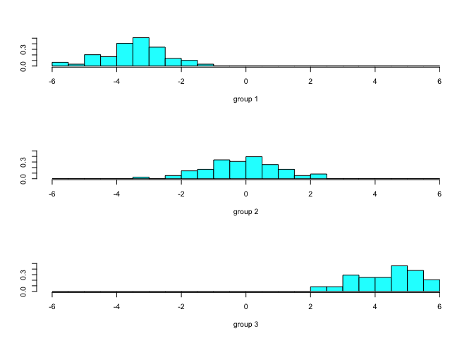

usando la segunda función discriminante:

    ldahist(data = wine.lda.values$x[,2], g=wine$Wine)

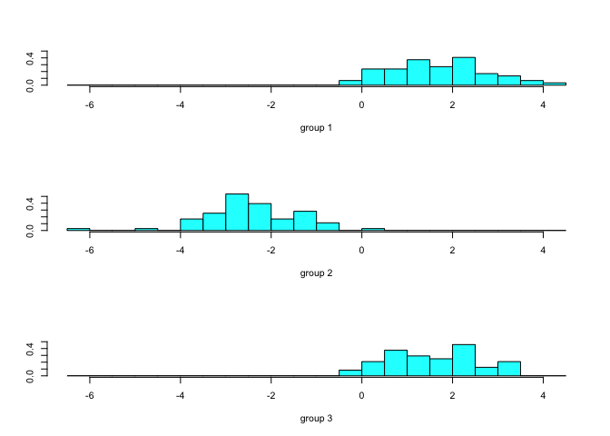

**Gráficos de las funciones discriminantes**

    plot(wine.lda.values$x[,1],wine.lda.values$x[,2]) # se realiza el grafico
    text(wine.lda.values$x[,1],wine.lda.values$x[,2],wine$Wine,cex=0.7,pos=4,col="red") # agregamos etiiquetas

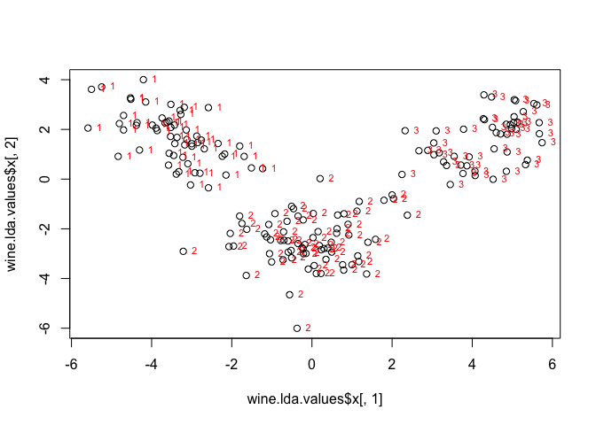

    spe.class <- predict(wine.lda)$class
    (spe.table <-table(wine$Wine, spe.class))

    ##    spe.class
    ##      1  2  3
    ##   1 59  0  0
    ##   2  0 71  0
    ##   3  0  0 48

### Ejemplo 2: Admisiones

El conjunto de datos proporciona datos de admisión para los solicitantes
a las escuelas de posgrado en los negocios. El objetivo es usar los
puntajes de GPA y GMAT para predecir la probabilidad de admisión
(admitir, no admitir y límite).

    url <- 'http://www.biz.uiowa.edu/faculty/jledolter/DataMining/admission.csv'
    admit <- read.csv(url)

    head(admit)

Realizamos un gráfico de los datos:

    adm <- data.frame(admit)
    plot(adm$GPA,adm$GMAT,col=adm$De)

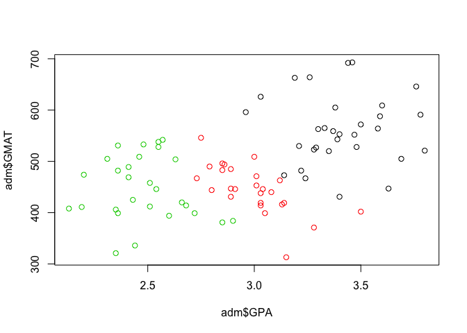

### Supuestos:

**Homogeneidad de varianzas multivariante**

    library(vegan)
    # seleccionamos las variables ambientales a analizar 
    env.pars2 <- as.matrix(adm[, 1:2])
    # verificamos la homogeneidad multivariada de las matrices de covarianza intra-grupo
    env.pars2.d1 <- dist(env.pars2)
    env.MHV <- betadisper(env.pars2.d1, adm$De)
    anova(env.MHV)

    permutest(env.MHV)

    ## 
    ## Permutation test for homogeneity of multivariate dispersions
    ## Permutation: free
    ## Number of permutations: 999
    ## 
    ## Response: Distances
    ##           Df Sum Sq Mean Sq      F N.Perm Pr(>F)
    ## Groups     2   6224  3112.0 2.4009    999  0.112
    ## Residuals 82 106285  1296.2

Conclusión: no rechazo la hipótesis nula de homogeneidad intra-grupo.

**Normalidad multivariante**

    library(mvnormtest)
    mshapiro.test(t(env.pars2))

    ## 
    ##  Shapiro-Wilk normality test
    ## 
    ## data:  Z
    ## W = 0.98854, p-value = 0.6623

No rechazamos la *H**o* de normalidad multivariante

**Multicolinealidad**

    as.dist(cor(env.pars2))

    ##            GPA
    ## GMAT 0.4606332

    library(MASS)
    m1 <- lda(De~.,adm)
    m1

    ## Call:
    ## lda(De ~ ., data = adm)
    ## 
    ## Prior probabilities of groups:
    ##     admit    border  notadmit 
    ## 0.3647059 0.3058824 0.3294118 
    ## 
    ## Group means:
    ##               GPA     GMAT
    ## admit    3.403871 561.2258
    ## border   2.992692 446.2308
    ## notadmit 2.482500 447.0714
    ## 
    ## Coefficients of linear discriminants:
    ##              LD1         LD2
    ## GPA  5.008766354  1.87668220
    ## GMAT 0.008568593 -0.01445106
    ## 
    ## Proportion of trace:
    ##    LD1    LD2 
    ## 0.9673 0.0327

Comenta los resultados.

Realizamos una predicción:

    predict(m1,newdata=data.frame(GPA=3.21,GMAT=497))

    ## $class
    ## [1] admit
    ## Levels: admit border notadmit
    ## 
    ## $posterior
    ##       admit    border     notadmit
    ## 1 0.5180421 0.4816015 0.0003563717
    ## 
    ## $x
    ##        LD1      LD2
    ## 1 1.252409 0.318194

**Análisis discrimante cuadrático**: Se trata de un procedimiento más
robusto que el lineal, y es útil **cuando las matrices de covarianza no
son iguales**. Se basa en la distancia de Mahalanobis al cuadrado
respecto al centro del grupo.

    m2 <- qda(De~.,adm)
    m2

    ## Call:
    ## qda(De ~ ., data = adm)
    ## 
    ## Prior probabilities of groups:
    ##     admit    border  notadmit 
    ## 0.3647059 0.3058824 0.3294118 
    ## 
    ## Group means:
    ##               GPA     GMAT
    ## admit    3.403871 561.2258
    ## border   2.992692 446.2308
    ## notadmit 2.482500 447.0714

Realizamos la predicción

    predict(m2,newdata=data.frame(GPA=3.21,GMAT=497))

    ## $class
    ## [1] admit
    ## Levels: admit border notadmit
    ## 
    ## $posterior
    ##       admit    border     notadmit
    ## 1 0.9226763 0.0768693 0.0004544468

**¿Qué modelo es el mejor?**

Para responder a esta pregunta, evaluamos el análisis discriminante
lineal seleccionando aleatoriamente 60 de 85 estudiantes, estimando los
parámetros en los datos de entrenamiento y clasificando a los 25
estudiantes restantes de la muestra retenida. Repetimos esto 100 veces

    n <- 85
    nt <- 60
    neval <-n-nt
    rep <- 100

    ### LDA
    set.seed(123456789)
    errlin <- dim(rep)
    for (k in 1:rep) {
    train <- sample(1:n,nt)
    ## linear discriminant analysis
    m1 <- lda(De~.,adm[train,])
    predict(m1,adm[-train,])$class
    tablin <- table(adm$De[-train],predict(m1,adm[-train,])$class)
    errlin[k] <- (neval-sum(diag(tablin)))/neval
    }
    merrlin <- mean(errlin) #media del error lineal
    merrlin

    ## [1] 0.0916

Ahora en el QDA:

    ### QDA
    set.seed(123456789)
    errqda <- dim(rep)
    for (k in 1:rep) {
    train <- sample(1:n,nt)
    ## quadratic discriminant analysis
    m1 <- qda(De~.,adm[train,])
    predict(m1,adm[-train,])$class
    tablin <- table(adm$De[-train],predict(m1,adm[-train,])$class)
    errqda[k] <- (neval-sum(diag(tablin)))/neval
    }
    merrqda <- mean(errlin)
    merrqda

    ## [1] 0.0916

Logramos una tasa de clasificación errónea del 10.2% en ambos casos. `R`
también nos da algunas herramientas de visualización. Por ejemplo en la
librería `klaR`:

    # Gráficos exploratorios para LDA or QDA
    #install.packages('klaR')
    library(klaR)
    partimat(De~.,data=adm,method="lda") 

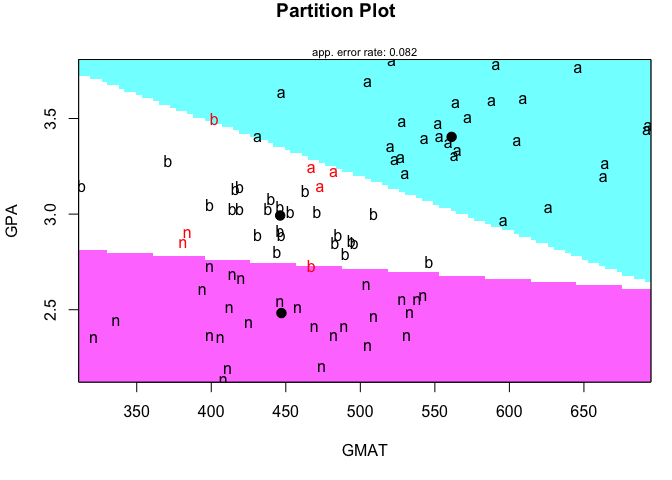

    partimat(De~.,data=adm,method="qda") 

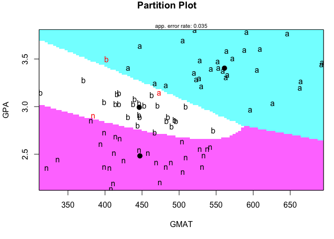

### Ejemplo 3: Score de crédito de un banco alemán

El conjunto de datos de crédito alemán se obtuvo del [Repositorio de
aprendizaje automático UCI](https://archive.ics.uci.edu/ml/index.php).
El conjunto de datos, que contiene atributos y resultados sobre 1000
solicitudes de préstamo, fue proporcionado en 1994 por el Profesor
Dr. Hans Hofmann del Institut fuer Statistik und Oekonometrie de la
Universidad de Hamburgo. Ha servido como un importante conjunto de datos
de prueba para varios algoritmos de puntuación de crédito. Una
descripción de las variables se da en `germancreditDescription.docx` de
`DataLectures`. Comenzamos cargando los datos:

    ## read data 
    credit <- read.csv("http://www.biz.uiowa.edu/faculty/jledolter/DataMining/germancredit.csv")
    head(credit,2) # Mira la codificación en el lugar indicado

Como se puede ver, solo las variables: duración, cantidad, plazos y edad
son numéricas. Con los restantes (indicadores) los supuestos de una
distribución normal serían, en el mejor de los casos, débiles; por lo
tanto, estas variables no se consideran aquí.

    cred1 <- credit[, c("Default","duration","amount","installment","age")]
    head(cred1)

    summary(cred1)

    ##     Default       duration        amount       installment   
    ##  Min.   :0.0   Min.   : 4.0   Min.   :  250   Min.   :1.000  
    ##  1st Qu.:0.0   1st Qu.:12.0   1st Qu.: 1366   1st Qu.:2.000  
    ##  Median :0.0   Median :18.0   Median : 2320   Median :3.000  
    ##  Mean   :0.3   Mean   :20.9   Mean   : 3271   Mean   :2.973  
    ##  3rd Qu.:1.0   3rd Qu.:24.0   3rd Qu.: 3972   3rd Qu.:4.000  
    ##  Max.   :1.0   Max.   :72.0   Max.   :18424   Max.   :4.000  
    ##       age       
    ##  Min.   :19.00  
    ##  1st Qu.:27.00  
    ##  Median :33.00  
    ##  Mean   :35.55  
    ##  3rd Qu.:42.00  
    ##  Max.   :75.00

Transformemos los datos en un data.frame

    cred1 <- data.frame(cred1)

-   Realiza las pruebas de los supuestos y comenta los resultados
-   Estima y compara lda con qda
-   Estima la matriz de confusión
-   ¿Usarías este modelo para una aplicación real?

Análisis de correlación canónica (CCA)
--------------------------------------

Para ilustrar el método vamos a usar el ejemplo 10.2.3 con el conjunto
de datos de la tabla 5.1.1 de Mardia, Kent, and Bibby (1979).

Los datos son:

-   *l*1: longitud de la cabeza del primer hijo
-   *l*2: longitud de la cabeza del segundo hijo
-   *b*1: amplitud (*breadth*) de la cabeza del primer hijo
-   *b*2: amplitud (*breadth*) de la cabeza del segundo hijo

Supongamos que **x** es un vector aleatorio de dimensión *q* y **y** es
un vector aleatorio de dimensión *p*. También supongamos que **x** e
**y** tienen medias **μ** y **ν**, y que

*E*{(**x** **−** **μ**)(**x** **−** **μ**)′} = **Σ**11

*E*{(**y** **−** **μ**)(**y** **−** **μ**)′} = **Σ**22

*E*{(**x** **−** **μ**)(**y** **−** **μ**)′} = **Σ**12 = **Σ**21

En `R`, usando estos datos tenemos:

    uu = "http://www1.maths.leeds.ac.uk/~charles/mva-data/headlengthandbreadth.dat"
    datos = read.csv(url(uu),sep = "")

    fz <- function(x)
    {
      return ( (x-mean(x))/sd(x))
    }

    datos = apply(datos,2,fz)

    (S11 = cov(datos[,1:2]))

    ##           l1        b1
    ## l1 1.0000000 0.7345555
    ## b1 0.7345555 1.0000000

    (S22 = cov(datos[,3:4]))

    ##           l2        b2
    ## l2 1.0000000 0.8392519
    ## b2 0.8392519 1.0000000

    (S12 = S21 = cov(datos[,])[1:2,3:4])

    ##           l2        b2
    ## l1 0.7107518 0.7039807
    ## b1 0.6931573 0.7085504

Ahora consideramos las dos combinaciones lineales *η* = **a****′****x**
y *ϕ* = **b****′****y**. La correlación entre *η* y *ϕ* es

$$
\\rho(\\boldsymbol{a,b}) = \\frac{\\boldsymbol{a'\\Sigma\_{12}b}}{(\\boldsymbol{a'\\Sigma\_{11}ab'\\Sigma\_{22}b})^{1/2}}
$$
 La notación *ρ*(**a****,** **b**) se usa para enfatizar que la
correlación cambia según los valores elegidos de **a** y **b**.

El objetivo es encontrar los vectores **a** y **b** que **maximizan**
*ρ*(**a****,** **b**), que es equivalente a

*m**a**x***a****,** **b****a****′****Σ****12****b**
 sujeto a

**a****′****Σ****11****a** = **b****′****Σ****22****b** = 1
 **Solución**

Sea

**K** **=** **Σ****11** **−** **1****Σ****12****Σ****22** **−** **1**

En `R`

    K = eigen(S11)$vectors %*% sqrt(solve(diag(eigen(S11)$values))) %*% solve(eigen(S11)$vectors) %*%
      S12 %*%
      eigen(S22)$vectors %*% sqrt(solve(diag(eigen(S22)$values))) %*% solve(eigen(S22)$vectors)

Ahora fijamos **N****1** **=** **K****K****′** y
**N****2** **=** **K****′****K** y

**M****1** **=** **Σ****11** **−** **1****N****1****Σ****11** **−** **1**
**M****2** **=** **Σ****22** **−** **1****N****2****Σ****22** **−** **1**

En `R`

    (N1 = K%*%t(K))

    ##           [,1]      [,2]
    ## [1,] 0.3192267 0.3093512
    ## [2,] 0.3093512 0.3054060

    (N2 = t(K)%*%(K))

    ##           [,1]      [,2]
    ## [1,] 0.3063796 0.3093714
    ## [2,] 0.3093714 0.3182531

    (M1 = solve(S11)%*%S12%*%solve(S22)%*%S21)

    ##           l2        b2
    ## l1 0.3213612 0.3206147
    ## b1 0.2980647 0.3029597

    (M2 = solve(S22)%*%S21%*%solve(S11)%*%S12)

    ##           l2        b2
    ## l2 0.3284513 0.3276745
    ## b2 0.2910913 0.2958697

**Definición**

Sea
**a***i* = **Σ****11** **−** **1****/****2****α****i**
y
**b***i* = **Σ****22** **−** **1****/****2****β****i**
para *i* = 1…*k* (*k* = *r**a**n**k*(**K**)), entonces

1.  Los vectores **a***i* y **b***i* son los
    iésimos **vectores canónicos** para **x** y **y** respectivamente.

2.  **α****i** y **β****i** son los vectores
    propios de **N****1** y **N****2**
    respectivamente.

3.  Las variables aleatorias
    *η**i* = **a****1****′****x** y
    *ϕ**i* = **b****1****′****y** son las iésimas
    **variables de correlación canónicas**.

4.  *ρ**i* = *λ**i*1/2 es e iésimo
    **coeficiente de correlación canónico**.

En `R`

    #a_1 a_2
    eigen(S11)$vectors %*% sqrt(solve(diag(eigen(S11)$values))) %*% solve(eigen(S11)$vectors)%*%
      eigen(N1)$vectors

    ##            [,1]      [,2]
    ## [1,] -0.5521896  1.366374
    ## [2,] -0.5215372 -1.378365

    #b_1 b_2
    eigen(S22)$vectors %*% sqrt(solve(diag(eigen(S22)$values))) %*% solve(eigen(S22)$vectors)%*%
      eigen(N2)$vectors

    ##           [,1]      [,2]
    ## [1,] 0.5044484 -1.768570
    ## [2,] 0.5382877  1.758566

De tal manera que las primeras variables de correlación canónica son

*η*1 =  − 0.552*l*1 − 0.522*b*1
 y

*ϕ*1 = 0.505*l*2 + 0.538*b*2

Los coeficientes de correlación canónica son:

    sqrt(eigen(M1)$values) # Canonical correlation coefficients

    ## [1] 0.78830930 0.05375324

### Supuestos

-   Normalidad (uni y multivariante dentro de **x** e **y**)
-   Linealidad (la no linealidad afecta las correlaciones)
-   Igual varianza

Note que este método no refleja relaciones no lineales en los datos.

### Un ejemplo en R

Usamos los datos `LifeCyclesSavings` para examinar ratio de ahorros
(ahorros/ingreso) del ciclo de vida desde 1960 hasta 1970.

El conjunto de datos tiene 50 observaciones y 5 variables:

-   sr = aggregate personal savings;
-   pop15 = % population under 15;
-   pop75 = % population over 75;
-   dpi = disposable income;
-   ddpi = % growth rate of dpi

<!-- -->

    library(CCA)
    ?LifeCycleSavings

Para correr el análisis de correlación canónica, primero investiguemos
más de la función `cancor()`

    ?cancor

Veamos los datos

    data("LifeCycleSavings")
    head(LifeCycleSavings)

El análisis

    pop <- LifeCycleSavings[,2:3]
    oec <- LifeCycleSavings[,-(2:3)]
    cancor(pop,oec)

    ## $cor
    ## [1] 0.8247966 0.3652762
    ## 
    ## $xcoef
    ##               [,1]        [,2]
    ## pop15 -0.009110856 -0.03622206
    ## pop75  0.048647514 -0.26031158
    ## 
    ## $ycoef
    ##              [,1]          [,2]          [,3]
    ## sr   0.0084710221  3.337936e-02 -5.157130e-03
    ## dpi  0.0001307398 -7.588232e-05  4.543705e-06
    ## ddpi 0.0041706000 -1.226790e-02  5.188324e-02
    ## 
    ## $xcenter
    ##   pop15   pop75 
    ## 35.0896  2.2930 
    ## 
    ## $ycenter
    ##        sr       dpi      ddpi 
    ##    9.6710 1106.7584    3.7576

Ahora usaremos el paquete `CCA` para obtener las matrices de correlación
canónica

    library(CCA)
    matcor(pop,oec)

    ## $Xcor
    ##            pop15      pop75
    ## pop15  1.0000000 -0.9084787
    ## pop75 -0.9084787  1.0000000
    ## 
    ## $Ycor
    ##             sr        dpi       ddpi
    ## sr   1.0000000  0.2203589  0.3047872
    ## dpi  0.2203589  1.0000000 -0.1294855
    ## ddpi 0.3047872 -0.1294855  1.0000000
    ## 
    ## $XYcor
    ##             pop15       pop75         sr        dpi        ddpi
    ## pop15  1.00000000 -0.90847871 -0.4555381 -0.7561881 -0.04782569
    ## pop75 -0.90847871  1.00000000  0.3165211  0.7869995  0.02532138
    ## sr    -0.45553809  0.31652112  1.0000000  0.2203589  0.30478716
    ## dpi   -0.75618810  0.78699951  0.2203589  1.0000000 -0.12948552
    ## ddpi  -0.04782569  0.02532138  0.3047872 -0.1294855  1.00000000

Ahora las correlaciones canónicas para función canónica

    (res.cc <- cc(pop,oec))

    ## $cor
    ## [1] 0.8247966 0.3652762
    ## 
    ## $names
    ## $names$Xnames
    ## [1] "pop15" "pop75"
    ## 
    ## $names$Ynames
    ## [1] "sr"   "dpi"  "ddpi"
    ## 
    ## $names$ind.names
    ##  [1] "Australia"      "Austria"        "Belgium"        "Bolivia"       
    ##  [5] "Brazil"         "Canada"         "Chile"          "China"         
    ##  [9] "Colombia"       "Costa Rica"     "Denmark"        "Ecuador"       
    ## [13] "Finland"        "France"         "Germany"        "Greece"        
    ## [17] "Guatamala"      "Honduras"       "Iceland"        "India"         
    ## [21] "Ireland"        "Italy"          "Japan"          "Korea"         
    ## [25] "Luxembourg"     "Malta"          "Norway"         "Netherlands"   
    ## [29] "New Zealand"    "Nicaragua"      "Panama"         "Paraguay"      
    ## [33] "Peru"           "Philippines"    "Portugal"       "South Africa"  
    ## [37] "South Rhodesia" "Spain"          "Sweden"         "Switzerland"   
    ## [41] "Turkey"         "Tunisia"        "United Kingdom" "United States" 
    ## [45] "Venezuela"      "Zambia"         "Jamaica"        "Uruguay"       
    ## [49] "Libya"          "Malaysia"      
    ## 
    ## 
    ## $xcoef
    ##              [,1]       [,2]
    ## pop15  0.06377599 -0.2535544
    ## pop75 -0.34053260 -1.8221811
    ## 
    ## $ycoef
    ##               [,1]          [,2]
    ## sr   -0.0592971550  0.2336554912
    ## dpi  -0.0009151786 -0.0005311762
    ## ddpi -0.0291942000 -0.0858752749
    ## 
    ## $scores
    ## $scores$xscores
    ##                       [,1]        [,2]
    ## Australia      -0.56253600  0.40390249
    ## Austria        -1.47152544 -0.87332319
    ## Belgium        -1.44772362 -1.03147293
    ## Bolivia         0.64585407 -0.58905269
    ## Brazil          0.95103425  0.86551308
    ## Canada         -0.40457624 -0.16057787
    ## Chile           0.62111144  0.55740907
    ## China           1.16878601  0.50796273
    ## Colombia        1.15651493 -0.68190575
    ## Costa Rica      1.19304831 -1.08123466
    ## Denmark        -1.23791620 -0.27758614
    ## Ecuador         1.09119961 -0.83511633
    ## Finland        -0.48857145  1.69786021
    ## France         -1.45930966 -1.84294039
    ## Germany        -1.11119865  1.06072429
    ## Greece         -0.87874295  0.93055884
    ## Guatamala       1.18358828 -0.18609424
    ## Honduras        1.36333825  0.02032415
    ## Iceland        -0.33557620 -1.16539024
    ## India           0.85064214  0.85175743
    ## Ireland        -0.89660448 -2.46031003
    ## Italy          -1.07829893  0.51703990
    ## Japan          -0.38486053  2.74651367
    ## Korea           0.89509245  0.83383808
    ## Luxembourg     -1.33690279  0.75116267
    ## Malta          -0.22287754  0.32393631
    ## Norway         -1.05180046 -0.19175733
    ## Netherlands    -0.98785900  0.88796621
    ## New Zealand    -0.45678604 -0.96933925
    ## Nicaragua       1.00339345 -0.54954583
    ## Panama          0.91241030 -0.15606348
    ## Paraguay        0.81170333  0.72072321
    ## Peru            0.92534657 -0.46157725
    ## Philippines     1.11184809 -0.69488593
    ## Portugal       -0.58059799  0.53923234
    ## South Africa   -0.19644195  0.82228337
    ## South Rhodesia  0.06108731  2.21221207
    ## Spain          -0.66521535  0.81212511
    ## Sweden         -1.63569355 -0.63352441
    ## Switzerland    -1.22912136  0.32265569
    ## Turkey          0.94434558  0.09809587
    ## Tunisia         1.07227152 -0.82338461
    ## United Kingdom -1.49174087 -0.95175452
    ## United States  -0.72389730 -0.73315394
    ## Venezuela       1.19569390 -0.32950372
    ## Zambia          1.23813259  0.58162543
    ## Jamaica         0.57631460 -0.50314665
    ## Uruguay        -0.58926282  0.98656605
    ## Libya           0.62443782 -1.77432308
    ## Malaysia        1.32844252 -0.09502380
    ## 
    ## $scores$yscores
    ##                        [,1]        [,2]
    ## Australia      -1.197582618 -0.16236396
    ## Austria        -0.514485534  0.33260994
    ## Belgium        -1.126047497  0.28011657
    ## Bolivia         1.175575433 -0.12494843
    ## Brazil          0.132491457  0.88183195
    ## Canada         -1.625987352 -1.08839364
    ## Chile           0.975882427 -1.79030274
    ## China           0.535391632  0.71855258
    ## Colombia        1.057642399 -0.59695499
    ## Costa Rica      0.543808669  0.67893036
    ## Denmark        -1.704368254  0.91924174
    ## Ecuador         1.155871496 -0.85121380
    ## Finland        -0.635218480  0.01315294
    ## France         -1.211470012  0.04020705
    ## Germany        -1.397266488 -0.01731182
    ## Greece          0.083021015  0.14211897
    ## Guatamala       1.209216281 -0.92679302
    ## Honduras        0.933602822  0.05262497
    ## Iceland        -0.150891245 -2.15783934
    ## India           1.036015081  0.57429510
    ## Ireland        -0.106933726  0.43825829
    ## Italy          -0.526164584  0.94515342
    ## Japan          -0.945445589  2.20814404
    ## Korea           1.100359257 -1.02841475
    ## Luxembourg     -1.205145263 -0.36666114
    ## Malta          -0.009000439  1.25130272
    ## Norway         -1.059225255 -0.45008336
    ## Netherlands    -0.989337775  0.49151632
    ## New Zealand    -0.349384397  0.20271478
    ## Nicaragua       0.892846437 -0.02931829
    ## Panama          0.807040147 -0.92369850
    ## Paraguay        1.344342456 -1.08273725
    ## Peru            0.557284192  1.34827236
    ## Philippines     0.740722188  1.38450895
    ## Portugal        0.206695290  0.61907452
    ## South Africa    0.375656978  0.71988759
    ## South Rhodesia  0.619330744  1.45344991
    ## Spain           0.167542079  0.61909114
    ## Sweden         -1.818231179 -1.75733210
    ## Switzerland    -1.628446935  0.32307189
    ## Turkey          0.948826794 -0.61162985
    ## Tunisia         1.267754398 -0.92230572
    ## United Kingdom -0.485816535 -0.66038997
    ## United States  -2.486211894 -1.91878127
    ## Venezuela       0.389454702  0.32762273
    ## Zambia          0.318834488  2.47265581
    ## Jamaica         0.591415820 -0.62589387
    ## Uruguay         0.391732707  0.24124982
    ## Libya           0.567959967 -0.77253487
    ## Malaysia        1.046343696 -0.81375377
    ## 
    ## $scores$corr.X.xscores
    ##             [,1]       [,2]
    ## pop15  0.9829821 -0.1837015
    ## pop75 -0.9697929 -0.2439299
    ## 
    ## $scores$corr.Y.xscores
    ##             [,1]        [,2]
    ## sr   -0.40500636  0.31259455
    ## dpi  -0.78728255 -0.09633306
    ## ddpi -0.03904398  0.05142128
    ## 
    ## $scores$corr.X.yscores
    ##             [,1]        [,2]
    ## pop15  0.8107603 -0.06710179
    ## pop75 -0.7998819 -0.08910177
    ## 
    ## $scores$corr.Y.yscores
    ##            [,1]       [,2]
    ## sr   -0.4910379  0.8557760
    ## dpi  -0.9545172 -0.2637266
    ## ddpi -0.0473377  0.1407737

Una evaluación visual

    plt.cc(res.cc, type ="i")  # argumento type ="i" imprime los países individualmente

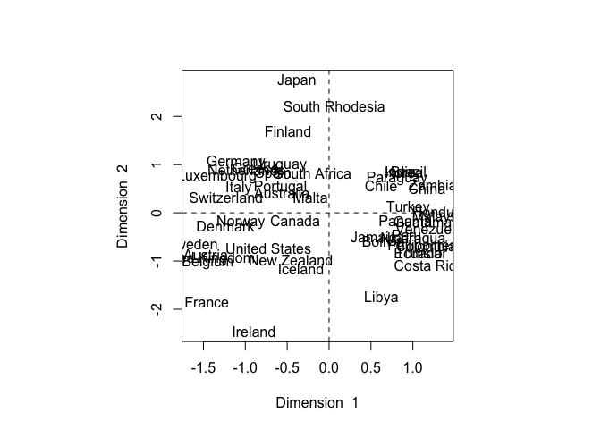

Los cuatro cuadrantes muestran una agrupación de los países en función
de su índice de ahorro del ciclo de vida (ahorro personal dividido por
el ingreso disponible) de 1960 a 1970. Japón tiene una proporción más
alta en la primera dimensión que Irlanda, por lo que Japón está
ahorrando más que lo que gasta.

### Significancia

    library(yacca)
    cca.fit <- cca(pop,oec)
    F.test.cca(cca.fit)

    ## 
    ##  F Test for Canonical Correlations (Rao's F Approximation)
    ## 
    ##          Corr        F   Num df Den df  Pr(>F)    
    ## CV 1  0.82480 13.49772  6.00000     90 7.3e-11 ***
    ## CV 2  0.36528       NA  2.00000     NA      NA    
    ## ---
    ## Signif. codes:  0 '***' 0.001 '**' 0.01 '*' 0.05 '.' 0.1 ' ' 1

La primera correlación canónica, *r* = .82, es estadísticamente
significativa (*F* = 13.49, *d**f* = 6.90, *p* &lt; .0001). La segunda
correlación canónica no informa una prueba *F*, lo cual no es
infrecuente en el análisis de correlación canónica, ya que la primera
variante canónica suele ser la única que es estadísticamente
significativa.

Referencias
===========

Mardia, Kanti, J. Kent, and J. Bibby. 1979. *Multivariate Analysis*.
First. New York: Academic Press.

Schumacker, Randall E. 2015. *Using R with Multivariate Statistics*.
Sage Publications.
